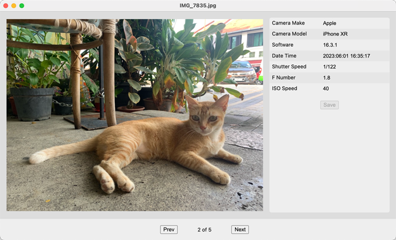

# EXIF Editor

This is a photo browser that lets you read and edit Exif metadata of JPEG files.

It should work outright, but only a few selected parameters are available for editing.

In fact, it is a tiny project I did for CS50x course, and I currently have no plan to develop it further.

Please feel free to fork it :&rpar;

## Video Demo
https://youtu.be/0N1gFQt_ZG8

## Libraries used

- [hMatoba/piexifjs](https://github.com/hMatoba/piexifjs/blob/master/piexif.js)
- [Electron](https://www.electronjs.org)